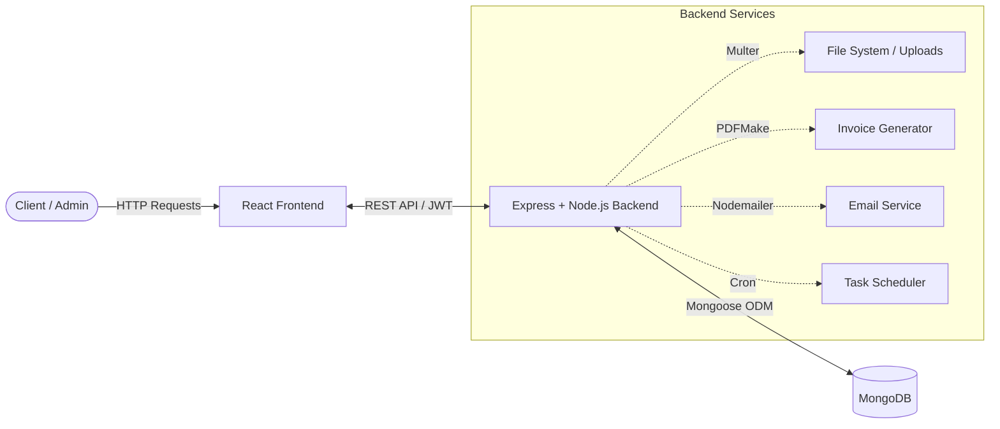
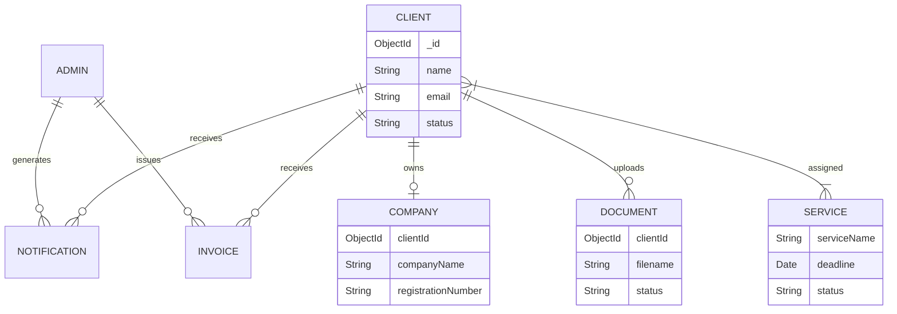

<div align="center">


# Accounts Ara

<a href="https://git.io/typing-svg">
  
</a>

<br/>

[](https://reactjs.org/)
[](https://nodejs.org/)
[](https://expressjs.com/)
[](https://www.mongodb.com/)
[](https://tailwindcss.com/)

</div>

<br/>

Accounts Ara is a full-stack web application designed to streamline operations for accounting firms. It provides a secure environment for administrators to manage clients, allocate dynamic services (e.g., VAT registration), track deadlines, verify documents, and generate invoices, while offering clients a self-service portal to update company profiles, request services, and upload sensitive documents.


##  Project at a Glance

<div align="center">

| Metric | Value | Description |
| :--- | :---: | :--- |
| **Features** | **8+** | Major functional modules implemented |
| **API Endpoints** | **50** | RESTful backend endpoints across Admin/Client |
| **Pages & Routes** | **35** | Unique frontend views and protected routes |
| **Database Models** | **10** | Structured MongoDB schemas |
| **Technologies** | **15+** | Core libraries and frameworks integrated |

</div>


##  Key Features

- **🔐 Dual-Role Authentication:** Secure login with JWT, OTP verification, and role-based route protection for Admins and Clients.
- **👥 Comprehensive Client Management:** Admins can onboard clients, edit profiles, and activate/deactivate accounts. Clients manage their own nested company profiles.
- **💼 Dynamic Service Allocation:** Create dynamic accounting services, assign them to specific clients, track completion statuses, process renewals, and monitor deadlines.
- **📄 Document Management & Verification:** Secure PDF uploads using Multer. Clients upload required documents; Admins review, approve, or reject them with real-time status updates.
- **🧾 Automated PDF Invoicing:** Admins can automatically generate, store, and distribute PDF invoices to clients using `pdfmake`.
- **📅 Calendar & Event Scheduling:** Built-in event management system for admins to track meetings, service deadlines, and important firm events.
- **🔔 Notification System:** Integrated cron-jobs (`node-cron`) and database triggers to alert users about document statuses, overdue services, and approaching deadlines.


##  Architecture

<details>
<summary><b>Click to expand Architecture Diagram</b></summary>
<br/>



</details>


##  How It Works

1. **Onboarding:** Admin adds a new Client or Client signs up.
2. **Setup:** Client completes their Personal and Company profile.
3. **Allocation:** Admin assigns a specific accounting service (e.g., VAT Registration) to the Client.
4. **Action:** Client receives a notification and uploads the required PDF documents via their portal.
5. **Verification:** Admin reviews the documents and updates the status to 'Approved' or 'Rejected'.
6. **Completion & Billing:** Once the service is fulfilled, Admin generates a PDF invoice which becomes immediately available on the Client's dashboard.


##  Tech Stack

| Layer | Technology |
| :--- | :--- |
| **Frontend** | React (v19), React Router DOM, Tailwind CSS |
| **State Management** | Redux Toolkit, Redux Persist |
| **UI Components** | Recharts, FontAwesome, Lucide React, React Toastify |
| **Backend** | Node.js, Express.js |
| **Database** | MongoDB, Mongoose |
| **Authentication** | JWT (JSON Web Tokens), bcryptjs |
| **File Handling** | Multer, PDFMake, `pdfjs-dist` |
| **Utilities** | Nodemailer (Emails), Node-cron (Scheduling), Date-fns |


##  Project Structure

```text
Accounts-Ara/
├── backend/                  # Node.js / Express backend
│   ├── src/
│   │   ├── controllers/      # Admin and Client route logic
│   │   ├── db/models/        # Mongoose schemas (Admin, Client, Document, etc.)
│   │   ├── middlewares/      # JWT Auth and PDF upload handlers
│   │   ├── routes/           # REST API route definitions
│   │   ├── schedulers/       # Cron jobs for deadlines/notifications
│   │   └── templates/        # Handlebars (hbs) email templates
│   └── uploads/              # Local storage for Documents and Invoices
│
└── frontend/                 # React application
    ├── public/
    └── src/
        ├── components/       # Reusable UI components (Admin, Client, Auth, Layout)
        ├── redux/            # Global state slices and store configuration
        └── App.js            # Main routing configuration
```


##  Getting Started

### Prerequisites
- **Node.js** (v18 or higher recommended)
- **MongoDB** (Local instance or MongoDB Atlas)

### Installation

1. **Clone the repository:**
   ```bash
   git clone https://github.com/jogiyamegha/Accounts-Ara.git
   cd Accounts-Ara
   ```

2. **Install Backend Dependencies:**
   ```bash
   cd backend
   npm install
   ```

3. **Install Frontend Dependencies:**
   ```bash
   cd ../frontend
   npm install
   ```

### Environment Variables

Create a `.env` file in the `backend/config` directory (or modify the path in `app.js`):

```env
PORT=8000
MONGODB_URI=your_mongodb_connection_string
JWT_SECRET=your_secret_key
EMAIL_USER=your_smtp_email
EMAIL_PASS=your_smtp_password
```

### Run Locally

1. **Start the Backend Server:**
   ```bash
   cd backend
   npm start
   ```
   *The server will run on the port specified in your `.env` (default typically 8000).*

2. **Start the React Frontend:**
   ```bash
   cd frontend
   npm start
   ```
   *The application will open in your browser at `http://localhost:3000`.*


##  API Overview

*Here are a few of the core endpoints utilized by the application:*

| Method | Endpoint | Purpose | Access |
| :--- | :--- | :--- | :--- |
| **POST** | `/admin/login` | Authenticate firm administrators | Public |
| **GET** | `/admin/client-management` | Retrieve all registered clients | Admin |
| **POST** | `/admin/add-client` | Register a new client account | Admin |
| **POST** | `/admin/assign-service/:id` | Allocate a service to a client | Admin |
| **POST** | `/admin/generate-invoice/:id` | Generate and store a client invoice | Admin |
| **POST** | `/client/login` | Authenticate firm clients | Public |
| **GET** | `/client/profile` | Fetch client's personal & company profile | Client |
| **POST** | `/client/documents/upload/...` | Upload required PDF documents | Client |


##  Data Model

<details>
<summary><b>Click to expand ER Diagram</b></summary>
<br/>


</details>


##  Future Improvements

- **Cloud Storage Integration:** Migrate local `multer` file uploads (documents & invoices) to AWS S3 or Firebase Storage for better scalability.
- **Payment Gateway Integration:** Add Stripe or PayPal to allow clients to pay generated invoices directly from their portal.
- **Enhanced Testing:** Implement unit testing for backend controllers using Jest and frontend component testing using React Testing Library.
- **Real-time Notifications:** Upgrade the current database-polling notification system to WebSockets (Socket.io) for instant alerts.
- **Dockerization:** Add `Dockerfile` and `docker-compose.yml` for seamless containerized deployment.

<br/>
<div align="center">
  <i>If you found this project helpful, consider giving it a ⭐!</i>
</div>
